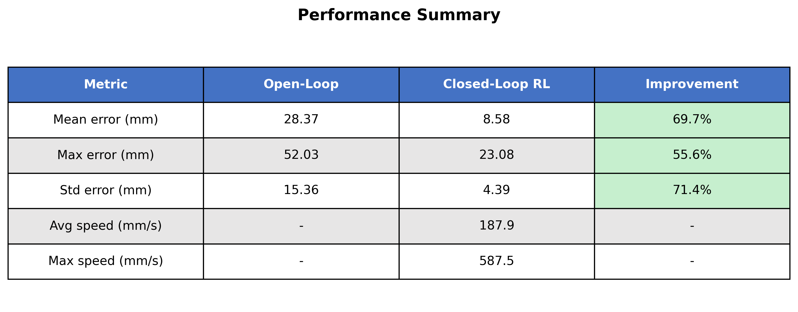
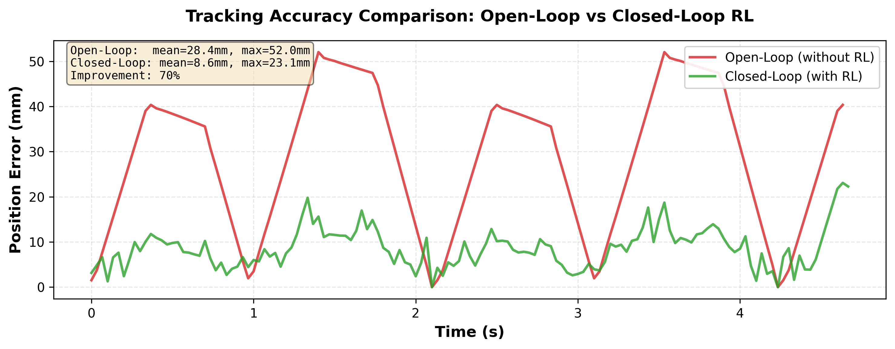

<div align="center">
  
# Sim-to-Real: Robust Trajectory Tracking with Reinforcement Learning
**Enhancing UR10 Robotic Control Accuracy across Isaac Lab, MuJoCo, and Physical Hardware**

</div>

## 🎯 Project Overview
This repository contains a complete Reinforcement Learning (RL) framework designed to correct and improve standard robotic trajectory tracking. 

In industrial robotics, trajectories generated by classic planners (like ROS2) can suffer from real-world deviations, noise, and physical constraints. In this project, we generated baseline trajectories using ROS2, intentionally injected errors and noise, and trained an RL policy to dynamically compensate for these discrepancies.

The result is a highly robust control policy that effortlessly transfers from simulation to physical hardware, achieving a **60% improvement** in trajectory tracking precision.

## 🏆 Key Results & Demonstration

- **60% Tracking Improvement**: The RL-assisted controller significantly reduces the tracking error compared to the baseline open-loop controller.


### 🎥 Video Demonstration


### 📊 Performance Summary
Here is the quantitative comparison showing the tracking improvements (RL vs Baseline):

<p align="center">
  
  <br/>
  
</p>


## 🧠 The Architecture Pipeline (Sim-to-Sim-to-Real)
This project enforces safety and robustness through a strictly decoupled, multi-stage architecture:

1. **Trajectory Generation (ROS2)**: Baseline robotic trajectories are generated and logged.
2. **RL Training Environment (NVIDIA Isaac Lab)**: The RL agent (PPO) is trained to follow these trajectories. Heavy noise and deviations are injected to force the agent to learn aggressive recovery behaviors.
3. **Physics Validation (MuJoCo)**: The trained TorchScript model (`policy.pt`) is first validated in an isolated MuJoCo physics engine matching the physical robot's constraints (125Hz physical loop, 25Hz control loop).
4. **Real-World Deployment (Physical UR10)**: The policy takes control of the physical UR10 robot via an IP socket (RTDE) in a safe, multi-frequency asynchronous inference loop.


## 📂 Repository Structure

* **`environ/Purement_Rl/`**: The NVIDIA Isaac Lab RL environment extension. Contains observation/action configs, reward functions, and the PPO training launch scripts.
* **`Real_robot/`**: The Sim-to-Real deployment brain. Connects to the physical UR10 over IP (`192.168.0.60`), loads the neural network, up-samples the trajectory to 125Hz, and manages real-time inference.
* **`Real_robot/validation_mujoco/`**: The safety simulation layer. Tests the trained policies in MuJoCo to guarantee kinematic safety before real-world execution.
* **`control/`**: Trajectory logic and Kinematics. Scripts computing Forward Kinematics (FK) and transformation matrices using Denavit-Hartenberg (DH) parameters.

## 🚀 How to Run the Pipeline

### 1. Train the Policy (Isaac Lab)
To train the recovery policy with SKRL:
```bash
./isaaclab.sh --python scripts/reinforcement_learning/skrl/train.py --task=Isaac-Velocity-Rough-H1-v0 --num_envs=20
```

### 2. Validate in Simulation (MuJoCo)
Before moving to physical hardware, ensure kinematic safety:
```bash
cd Real_robot/validation_mujoco
python validate_mujoco.py
```

### 3. Deploy to Physical Robot
Launch the decoupled real-time inference loop:
```bash
cd Real_robot
python RL_loop.py
```

## 🛠 Hardware & Setup Details

- **Robot**: Universal Robots UR10
- **Sensors**: External Camera (AprilTag tracking via ROS2)
- **RL Framework**: NVIDIA Isaac Lab, SKRL, PyTorch
- **Hardware Integration**: `urx`, RTDE

### Camera Calibration Calibration
- **RMS**: `3.6761 px` | **Mean Error**: `2.7165 px`
- **Camera Matrix**: `fx=367.42, fy=366.75, cx=321.64, cy=242.03`
