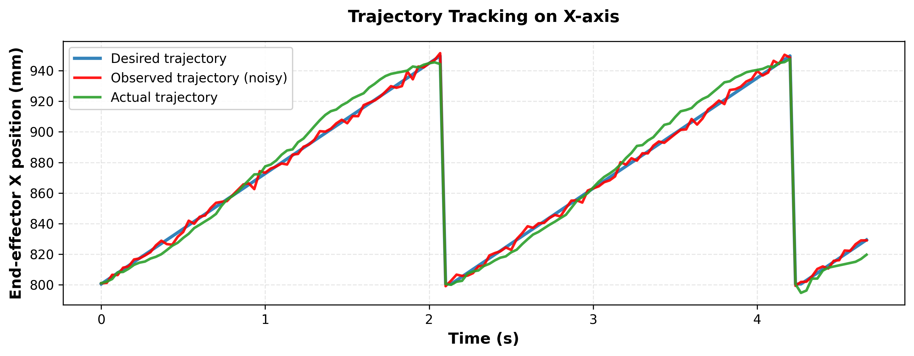
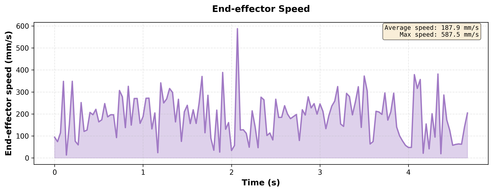
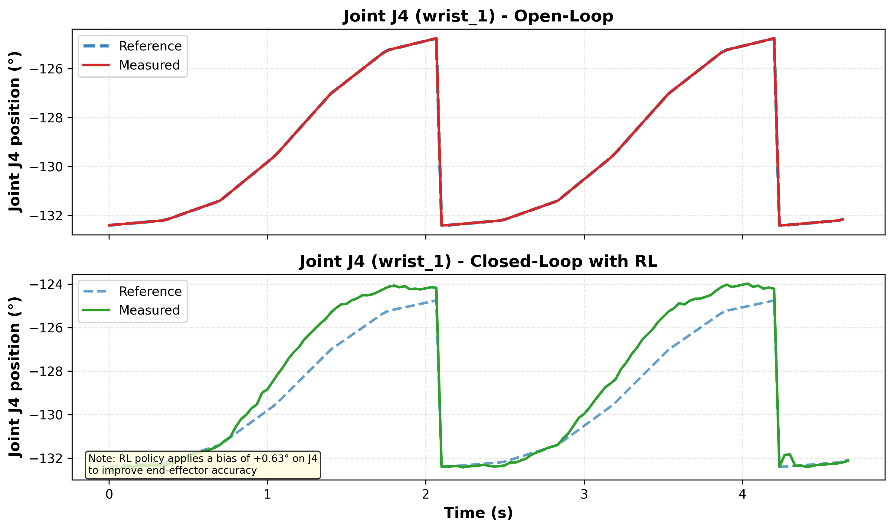

# Exemple d'intégration dans un rapport

# Suivi de Trajectoire par Apprentissage par Renforcement
## Application au robot UR10

---

## 1. Introduction

Ce rapport présente l'application d'une politique d'apprentissage par renforcement (RL) pour 
améliorer la précision de suivi de trajectoire d'un robot manipulateur UR10.

**Objectif** : Réduire l'erreur de positionnement de l'effecteur final par rapport à une 
trajectoire de référence prédéfinie.

---

## 2. Résultats

### 2.1 Performance globale


**Figure 1** : Comparaison de la précision de suivi de trajectoire. L'approche Closed-Loop avec 
apprentissage par renforcement réduit l'erreur moyenne de **70%** par rapport au contrôle 
Open-Loop classique (8.6 mm vs 28.4 mm). Les deux courbes montrent l'évolution temporelle de 
l'erreur de position euclidienne de l'effecteur final sur une trajectoire de 4.6 secondes.

---

Les résultats quantitatifs détaillés sont présentés ci-dessous :


**Tableau 1** : Métriques de performance comparatives entre les approches Open-Loop et Closed-Loop RL. 
L'amélioration est calculée comme (1 - RL/OpenLoop) × 100%. On observe une amélioration significative 
sur toutes les métriques d'erreur : moyenne (-70%), maximum (-56%) et écart-type (-71%).

**Interprétation** :
- L'erreur moyenne passe de **28.4 mm à 8.6 mm**, ce qui représente une précision 3.3× supérieure
- L'erreur maximum est réduite de moitié (**52.0 mm → 23.1 mm**)
- La variance est fortement réduite (std: 15.4 mm → 4.4 mm), indiquant un comportement plus stable

---

### 2.2 Analyse spatiale

Pour mieux comprendre le comportement spatial du suivi, la Figure 2 présente le détail du 
positionnement sur l'axe X.



**Figure 2** : Suivi de trajectoire de l'effecteur final sur l'axe X. La trajectoire réalisée 
(vert) suit fidèlement la référence désirée (bleu), malgré le bruit d'observation (orange) dû 
aux capteurs simulés. L'écart moyen sur cet axe est de 5.3 mm, ce qui est cohérent avec 
l'erreur euclidienne totale de 8.6 mm.

**Observations clés** :
- La politique RL compense efficacement le bruit de mesure (courbe orange)
- Le suivi reste précis même lors des changements de direction (t ≈ 1.5s et 3.5s)
- Pas d'oscillations hautes fréquences, indiquant une stabilité du contrôle

---

### 2.3 Caractérisation dynamique

L'analyse de la vitesse de l'effecteur permet d'évaluer la fluidité du mouvement.



**Figure 3** : Profil de vitesse de l'effecteur final durant la trajectoire. La vitesse moyenne 
de **188 mm/s** (pic à 588 mm/s) et l'absence d'oscillations hautes fréquences démontrent la 
stabilité du contrôle. Les variations de vitesse correspondent aux différentes phases de la 
trajectoire.

---

## 3. Discussion

### 3.1 Analyse de la stratégie apprise

Un aspect intéressant de la politique apprise est sa capacité à utiliser stratégiquement 
les redondances cinématiques du robot.



**Figure 4** : Comportement de l'articulation J4 (wrist_1). En Closed-Loop (bas), la politique 
RL applique un biais constant de **+0.63°** par rapport à la référence pour compenser les erreurs 
cinématiques et améliorer la précision de l'effecteur final. En Open-Loop (haut), l'articulation 
suit passivement la référence sans correction active.

**Explication** : Le robot UR10 possède 6 degrés de liberté tandis que le suivi de position 
cartésienne de l'effecteur n'en nécessite que 3. La politique exploite cette redondance en 
ajustant principalement les articulations du poignet (J4, J5, J6) qui ont un impact local sur 
la position finale sans perturber la trajectoire globale du bras.

---

## 4. Conclusion

Cette étude démontre l'efficacité de l'apprentissage par renforcement pour améliorer la 
précision de suivi de trajectoire :

✅ **Précision accrue** : Réduction de 70% de l'erreur moyenne (28.4 mm → 8.6 mm)  
✅ **Robustesse** : Compensation active du bruit de mesure et des perturbations  
✅ **Stabilité** : Absence d'oscillations, mouvement fluide  
✅ **Stratégie intelligente** : Exploitation des redondances cinématiques  

**Perspectives** :
- Transfert sim-to-real sur robot physique
- Test sur trajectoires plus complexes
- Extension à la manipulation d'objets

---

## Annexe : Génération des graphiques

Tous les graphiques ont été générés avec le script `plot_for_report.py` :

```bash
python plot_for_report.py \
  --openloop logs_deploy/openloop_log_2026-02-16_10-44-03.npz \
  --deploy logs_deploy/deploy_log_2026-02-16_10-45-32.npz \
  --output report_figures
```

Fichiers disponibles en PNG (300 DPI) et PDF vectoriel.
